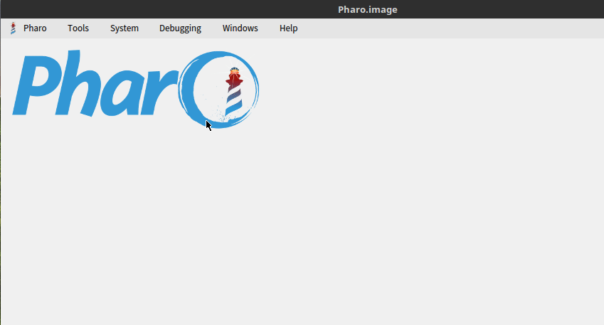
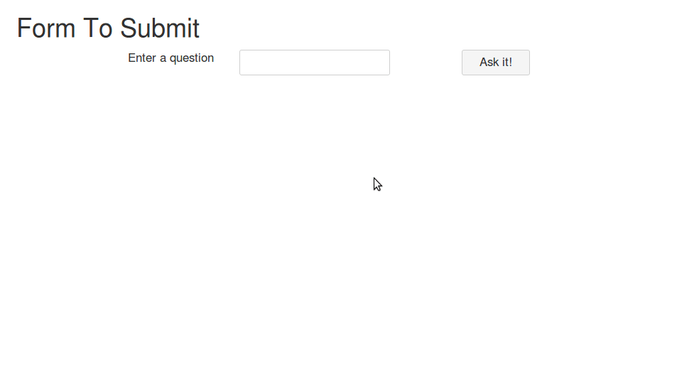
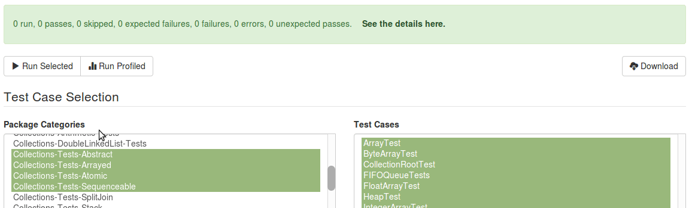

# Interaction Affordances

Each interactive component in Willow supports the `#on` message, which afterwards
must indicate an event (`#trigger` by default), to provide access to the
interaction affordances. It basically attaches an event handler function to the
corresponding DOM element, whose code depends on what interaction affordances
are used. So lets see first a simple example, that does not involve "server aware"
code:

```smalltalk
button on trigger
  userAgentDo: [:canvas |
    canvas javascript alert: 'Hello World!'
  ]
```

When the button gets rendered into the DOM it will attach an event handler to
the `<button>` for the `click` event with the handler function:

```javascript
function(event) {
  alert("Hello World!")
}
```

The event that gets bound by default (when using `#on trigger`) depends on the
type of component used:

- `click`
  - Button
  - Link
  - Check Box
  - Image
  - Container (`div` or `span`)
  - Table
  - List
- `change`
  - Single line Text Field
  - Multi line Text Field
  - Date Field
  - Number Field
  - Multiple Selection List Box
  - Single Selection List Box
  - Drop Down List
  - Radio Button

  This can be overridden by specifying the event. So `#on click` can be sent to
  indicate that specific behavior for a text field, for example:

```smalltalk
textField on click
  userAgentDo: [:canvas |
    canvas javascript alert: 'Hello World!'
  ]
```

Willow provides native support for `click`, `change`, `keyup` and `mouseover`
but any event can be used by sending `#on eventNamed:`.

## Summary

- General
  - `userAgentDo:`
  - `serverDo:` :computer:
  - `with:serverDo:` :computer:
  - `with:onlyWhen:serverDo:` :computer:
- Serialization
  - `serializeChildForm` :computer:
  - `serializeContainerForm` :computer:
  - `serializeForm:` :computer:
  - `serializeIt` :computer:
  - `serializeWithHiddenInputs` :computer:
  - `submitForm:` :computer:
  - `submitFormStyledAs:` :computer:
- DOM Interaction
  - `enable:`
  - `disable`
  - `disable:`
  - `focus:` :computer:
  - `focusUsing:` :computer:
  - `remove:` :computer:
  - `render:` :computer:
  - `renderAll:` :computer:
  - `setValueTo:thenTriggerChangeOf:` :computer:
  - `setValueTo:withoutTriggeringChangeOnComponentWithId:` :computer:
  - `show:whileCallingServerToRender:` :computer:
  - `temporarilyDisableAndTransform:into:` :computer:
  - `temporarilyDisableAndTransformInto:` :computer:
  - `transform:into:`
  - `scrollIntoView:` :computer:
  - `showLoadingNotificationDisplaying:applying:` :computer:
  - `showLoadingNotificationStyledAsAll:` :computer:
- CSS Manipulation
  - `updateCssClasses:`
  - `updateCssClasses:onElementsMatching:`
- Dialogs
  - `open:` :computer:
  - `closeLastDialog` :computer:
  - `closeAllDialogs` :computer:
- Debugging
  - `confirmAsking:` :computer:
  - `inform:`
  - `informSelection`

> :computer: indicates the command generates a request to the server. This is
> not always because the server needs information related to the command from
> the user agent, but because Willow expects the JavaScript associated with the
> command to be executed after the server completes all necessary processing.

## General Affordances

### User Agent Execution

This affordance allows you to configure some JavaScript code to be run in the
browser without notifying the server. We already saw an example.

It uses the Seaside JavaScript generation support, and it's usually used as a
basic building block to do more complex behavior on top.

### Server Evaluation

This affordance allows you to configure an AJAX call bound to a callback on the
server. So, for example:

```smalltalk
button on trigger
  serverDo: [
    'The button was clicked on the browser' inspect
  ]
```

will yield a handler function that looks something like:

```javascript
function(event) {
  Willow.callServer({
    "url": "/app",
    "data": ["_s=I9CKSDJSLDAiicmC", "_k=KXMnjdjd112JJJ" , "21"]
  })
}
```

where `Willow.callServer` is built on top of standard AJAX support, configuring
some basic stuff including the error handling.



This AJAX function has a counterpart callback on the server that will evaluate
the user provided block.

Sometimes you want the return of the AJAX call to vary depending on what happens
in the server. To do that you must reference an optional variable in the block,
which represents the request received from the user agent and which response can
be configured to determine what happens when the AJAX call returned.

For example:

```smalltalk
button on trigger serverDo: [:request |
    self someServerSideCondition
      ifTrue: [ request onRespond inform: 'Condition is true' ]
  ]
```

will yield a handler function similar to evaluate, but if the condition is true
when the block is evaluated in the server, the AJAX call response will include
code to display an `alert` showing "Condition is true".

You can apply any interaction affordance to `request onRespond`, just like you
would do to `on trigger`.

### Server Evaluation with client parameters

Sometimes you need to send additional information to the server (not necessarily
user input). For that you have `with:serverDo:`.

Let's see an example:

```smalltalk
button on trigger
  with: ((JSStream on: 'navigator') access: 'userAgent')
  serverDo: [:request | self saveIt: request parameter ]
```

the handler function will look similar to:

```javascript
function(event) {
  Willow.callServer({
    "type": "POST",
    "url": "/app",
    "data": ["_s=I9CKSDJSLDAiicmC", "_k=KXMnjdjd112JJJ" , "2" , "3=" +
      encodeURIComponent(JSON.stringify(navigator.userAgent))]
  })
}
```

When the callback is evaluated in the server, the value of `request parameter`
will be an object (produced by using `WAJsonParser`) with the information sent
in the call.

There's also support for performing the AJAX call only when some condition is
met. You can use `with:onlyWhen:serverDo:` and indicate a block that receives a
`JSObject` representing the parameter from the first argument.

## Serialization

When using Willow, your application will not normally require a full page
submission. When working with form elements the contents must be serialized in
an AJAX call, so the server components have the updated values. Depending on the
interactivity level you want in your application you have several options.

Let's see an example:

```smalltalk
button on trigger serializeContainerForm
```

the handler function will look like:

```javascript
function(event) {
  Willow.callServer({
    "type": "POST",
    "url": "/app",
    "data": ["_s=I9CKSDJSLDAiicmC", "_k=KXMnjdjd112JJJ" , "57" ,
              $(this).closest("form").find(".input").serialize()
            ]
  })
}
```



In this case when a button is clicked all the input information inside the
closest form to the button will be serialized and sent to the server. Combining
this with `serverDo:` in the same interaction guarantees the server components
will have the updated values before evaluating the callback.

The main difference between the serialization affordances is what get serialized.
So:

- `serializeContainerForm` will find the form closest to the component receiving
  the on trigger collaboration
- `serializeChildrenForm` will find a form in the children of the component
  receiving the on trigger collaboration
- `serializeForm:` will find a specific form via its #id
- `serializeIt` will serialize the component receiving the on trigger
  collaboration (this would normally be used in tandem with some field component
  then triggering the change event)
- `serializeWithHiddenInputs` will serialize the component receiving the `on trigger`
  collaboration and the next hidden input (required for some Seaside
  brushes where the resulting HTML includes a hidden input)

In case you need it, there's also support to submit a form: `submitForm:`. Also,
`submitFormStyledAs:` will call the `submit()` function on the corresponding
form (found by id or by matching its "class").

Serialization will occur automatically when triggering certain components.

- Fields, single selections and radio buttons will serialize the component, thus
  ensuring an updated value in the server, every time they change.
- Checkboxes will serialize the hidden element used by Seaside to determine its
  boolean value.
- Multiple selections will serialize on change, including the hidden element used
  by Seaside.

## DOM Interaction

### Rendering

The `render:` affordance is one of the most useful ones. You can replace portions
of the DOM with new elements that will be rendered by the server and returned as
part of the payload of the AJAX call response.

Let's see an example:

```smalltalk
currentTimeView := self componentSupplier
  inlineContainerWrapping: [ :canvas | canvas strong: Time now ]
  applying: [].
button on trigger render: currentTimeView
```

This will configure the handler function bound to the button click event to
perform an AJAX call. When the call is complete it will replace the DOM contents
of the component with some updated rendering.


Inspecting the response payload of the AJAX call you would see something like:

```javascript
$("#current-time-id12").html("<strong>16:58:33</strong>")
```

In case you want to render several views at once you can use `renderAll:`.

You can also show some kind of spinner or throbber while the AJAX call to render
a view is in progress. This is done sending `show:whileCallingServerToRender:`.
For example:

```smalltalk
button show: 'Searching...' whileCallingServerToRender: container
```

will yield something like

```javascript
function(event) {
  $("#container-id").html("Searching...");
  Willow.callServer({
      "url": "/app",
      "data": ["_s=I9CKSDJSLDAiicmC", "_k=KXMnjdjd112JJJ" , "21"]
  })
}
```

The browser will show "Searching..." in the container place while the AJAX call
is performed. Once it returns it will be replaced with the contents again, now
with the updated rendering.

### Enable/disable

You can disable a component in the DOM by using `disable`, so for example:

```smalltalk
button on trigger disable
```

will yield the following handler function:

```javascript
function(event) {
  $(this).prop("disabled", true)
}
```

That will disable the button when clicked.

You can also enable a component by using `enable:`

### Focus

By using `focus:` and `focusUsing:` you can call `focus()` on a DOM element when
returning from the AJAX call. You can also use `scrollIntoView:` and this will
call `scrollIntoView()` instead of `focus()`.

### Remove

By using `remove:` you can remove an element from the DOM (calling `remove()`)
when returning from the AJAX call.

### Setting input values

You can set an input value (without replacing the DOM element) by using
`setValueTo:thenTriggerChangeOf:` and `setValueTo:withoutTriggeringChangeOnComponentWithId:`.
This will perform an AJAX call to the server to get the new value and update it
in the input. Depending on the affordance in use will trigger the change event
or not.

## Combining Interactions

You can combine several affordances in the same `on trigger` so they will end
up in the same handler function. For example:

```smalltalk
runSelectedTestsButton on trigger
        transform: testResult into: SpinKitTripleBounce new;
        serverDo: [ self session runTests ];
        render: testResult.
```

will show a spinner, perform an AJAX call, the server will process the callback
running some tests and when the AJAX call is complete it will render again the
updated test result.


